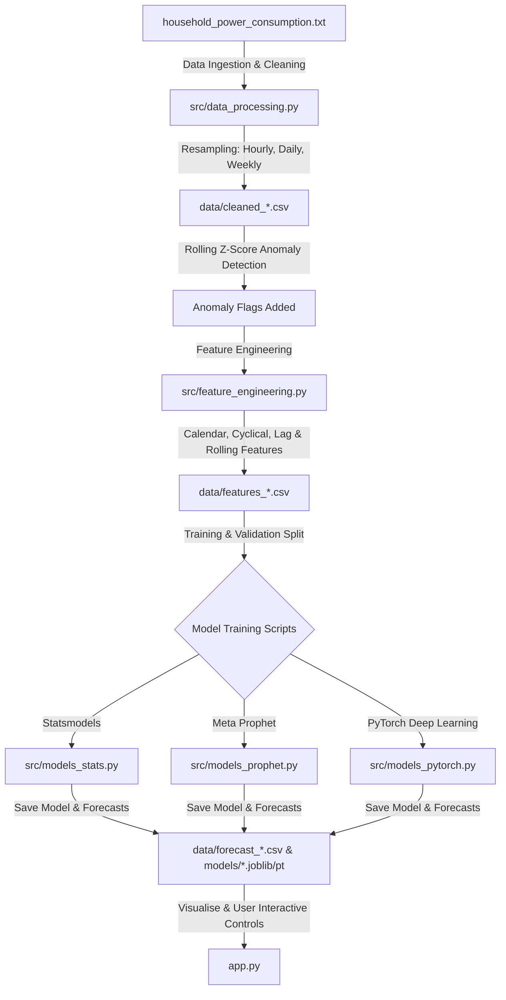

# Smart Home Energy Analytics & Forecasting Dashboard
## Enterprise-Grade Time-Series Forecasting Platform

This document provides a comprehensive guide to building, training, and running the **Smart Home Energy Analytics & Forecasting Dashboard** from start to finish. It details the system architecture, mathematical formulations of the models, the engineering pipeline, and the step-by-step process of project completion.

---

## 🗺️ Project Architecture & Pipeline Flow
The project is built as a modular pipeline in Python 3.12.10, scaling from raw data ingestion to a multi-model interactive visualization dashboard using **Streamlit**.



---

## 📁 Repository Structure
```
claysys_energy_consumption_forecasting/
│
├── app.py                     # Streamlit multi-tab visual analytics & forecasting dashboard
├── shift_dates.py             # Utility to shift historical dataset dates to end at "yesterday"
├── requirements.txt           # Complete list of Python libraries and dependencies
│
├── src/
│   ├── __init__.py            # Module initializer
│   ├── data_processing.py     # Reads, interpolates, resamples raw dataset, and flags anomalies
│   ├── feature_engineering.py # Adds calendar, cyclical (sin/cos), lag, and rolling window features
│   ├── models_stats.py        # SARIMAX model evaluation, retraining, and multi-horizon forecasting
│   ├── models_prophet.py      # Meta Prophet model evaluation, training, and multi-horizon forecasting
│   └── models_pytorch.py      # Bidirectional LSTM with Temporal Self-Attention and custom DataLoader
│
├── data/                      # Auto-generated directory containing datasets, features, and forecasts
│   ├── cleaned_{scale}.csv    # Resampled data with anomaly flags (hourly, daily, weekly)
│   ├── features_{scale}.csv   # Engineered features (hourly, daily, weekly)
│   ├── forecast_{model}_{horizon}.csv  # Out-of-sample future projections
│   └── metrics_{model}.csv    # Validation MAE & RMSE metrics for each horizon
│
└── models/                    # Saved serialization objects for models (.joblib, .pt)
```

---

## 🛠️ Tech Stack & Tools Used
1. **Core Runtime**: Python 3.12.10
2. **Web Interface**: Streamlit (Light/Clean modern responsive design, interactive Plotly visualization)
3. **Data Manipulation**: Pandas, NumPy
4. **Machine Learning & Time-Series**:
   - **statsmodels (SARIMAX)**: Classical parametric auto-regressive statistical model
   - **prophet**: Meta's additive regression model for strong seasonal effects
   - **PyTorch**: Deep Learning Framework used to build the custom Attention-LSTM model
5. **Serialization**: Joblib (for Statsmodels and Prophet models), PyTorch State Dicts (for LSTM)

---

## ⚙️ Step-by-Step Pipeline & Component Details

### 1. Data processing (`src/data_processing.py`)
* **Raw Ingestion**: Reads the UCI `household_power_consumption.txt` semicolon-separated dataset.
* **Cleaning**: Parses date and time to a unified timezone-naive Datetime index, casts numerical parameters (`Global_active_power`, sub-metering feeds), and handles missing data.
* **Interpolation**: Combines **linear interpolation** with forward/backward fills (`ffill().bfill()`) to guarantee zero NaNs.
* **Rolling Z-Score Anomaly Detection**:
  Calculates a rolling mean $\mu_t$ and rolling standard deviation $\sigma_t$ over a moving window:
  $$Z_t = \frac{x_t - \mu_t}{\sigma_t + 10^{-8}}$$
  If $|Z_t| > 3.0$, the timestep is flagged as an anomaly.
* **Resampling**: Aggregates raw minute-level data into:
  - **Hourly** (for 1-Day Horizon)
  - **Daily** (for 10-Day Horizon)
  - **Weekly** (for 1-Year Horizon)

### 2. Feature Engineering (`src/feature_engineering.py`)
Generates 28 features to assist models in recognizing seasonal and temporal patterns:
* **Time-Calendar Features**: Extracts hour, day of week, month, quarter, day of year, weekend flag, and season indices.
* **Cyclical Temporal Encoding**: Resolves boundary discontinuities (e.g., hour 23 to 00) using sine and cosine transformations:
  $$\text{hour\_sin} = \sin\left(\frac{2\pi \cdot t}{24}\right), \quad \text{hour\_cos} = \cos\left(\frac{2\pi \cdot t}{24}\right)$$
* **Lag Features**: Shifts target variable backward (`lag_1`, `lag_2`, `lag_3`, etc.) to capture immediate historical trends.
* **Rolling Windows**: Computes moving average and standard deviations over windows matching scale lengths (e.g., 6h, 12h, 24h for hourly data).

### 3. Time-Series Forecasting Models

#### A. SARIMAX (`src/models_stats.py`)
* **How it works**: A classical statistical forecasting method combining Auto-Regressive (AR) lags, Integrated (I) differencing to achieve stationarity, and Moving Average (MA) error corrections.
* **Configuration**: Leverages a non-seasonal $SARIMAX(1,1,1)$ setup computed over localized historical windows to speed up inference times while preserving trend capturing.

#### B. Meta Prophet (`src/models_prophet.py`)
* **How it works**: A curve-fitting regression model that decomposes time-series into:
  $$y(t) = g(t) + s(t) + h(t) + \epsilon_t$$
  where $g(t)$ is non-periodic trend, $s(t)$ represents seasonality (yearly, weekly, daily), and $h(t)$ is holiday effects.
* **Robustness**: Highly resistant to missing values and shifts in trend.

#### C. Upgraded PyTorch Attention-LSTM (`src/models_pytorch.py`)
To maximize accuracy and modeling capacity, the LSTM model was upgraded with the following architectures:
* **Bidirectional LSTM**: Processes the sequence in both forward and backward directions, capturing surrounding temporal contexts.
* **Temporal Self-Attention**: Rather than relying on the last hidden state of the LSTM, an attention layer weights all hidden states across timesteps using a scaled-dot-product:
  $$\text{score}_t = \mathbf{w}^\top \tanh(\mathbf{W}_a \mathbf{h}_t + \mathbf{b}_a)$$
  $$\alpha_t = \text{softmax}(\text{score}_t)$$
  $$\text{context} = \sum_{t} \alpha_t \mathbf{h}_t$$
* **LayerNorm & MLP Regressor**: Context vectors are normalized using LayerNorm, passed through a dropout layer, processed by a two-layer Multi-Layer Perceptron (MLP) with **GELU** activation, and mapped to a single regressed scalar prediction.
* **Autoregressive Forecasting**: Out-of-sample predictions are generated step-by-step, feeding the model's predictions back as inputs for future steps.

---

## 📈 Dashboard Features (`app.py`)
The user interface is split into three rich interactive tabs:
1. **Historical Insights**: Shows high-level KPIs (Total active power, peak demand, averages, and anomaly counts), an anomaly overlay plot, a daily OHLC Candlestick chart for energy ranges, and a calendar heatmap of intensity.
2. **Sub-Metering Breakdown**: Visualizes contribution ratios of kitchen (Sub 1), laundry (Sub 2), AC/heating (Sub 3), and unmetered appliances. Includes a pairwise correlation matrix of all features.
3. **Future Demand Forecast Engine**: Plots future projections for the selected horizon with a $\pm15\%$ confidence band. Includes cost predictions in INR (₹) and USD ($) based on configurable tariff sliders, and details performance comparisons (MAE & RMSE metrics).

---

## 🚀 Setup & Execution Instructions

### Prerequisites
Ensure Python 3.12.10 is installed.

### 1. Environment Setup
Clone the project and install all required libraries:
```bash
pip install -r requirements.txt
```

### 2. Prepare Data & Run Pipeline
Place `household_power_consumption.txt` inside the `data/` directory.

Run the end-to-end ML pipeline:
```bash
# Step 1: Clean raw data and resample
python src/data_processing.py

# Step 2: Shift dataset dates to align with current dates (optional, for demo)
python shift_dates.py

# Step 3: Extract temporal and lag features
python src/feature_engineering.py

# Step 4: Evaluate and train SARIMAX
python src/models_stats.py

# Step 5: Evaluate and train Meta Prophet
python src/models_prophet.py

# Step 6: Train Bidirectional Attention-LSTM Regressor (PyTorch)
python src/models_pytorch.py
```

### 3. Launch Dashboard
Start the Streamlit application:
```bash
streamlit run app.py
```
Open [http://localhost:8501](http://localhost:8501) in your browser.
